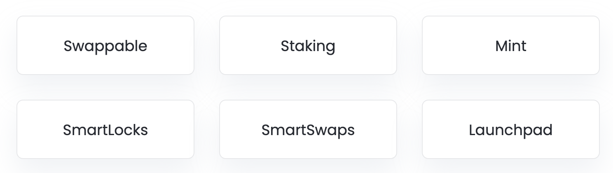

```{r setup, include=FALSE} 
knitr::opts_chunk$set(echo=FALSE, message=FALSE, warning=FALSE)
```

# Introduction to Launchpads

This post uses market data from Coingecko's API for exploratory data analysis of several launchpad cryptocurrency companies. These companies partner with new projects and help them launch into the crypto space by providing a mechanism for fundraising and exposure to the launchpad's connections and community of token holders. In turn, the token holders benefit from early investment access to these new projects. 

After visualizing market data, I will take a deeper dive into TrustSwap. We will consider TrustSwaps's fundamental objectives by webscraping info regarding their services, roadmap and tokenomics from various sources such as TrustSwap's [website](https://trustswap.org) and [etherscan](https://etherscan.io/token/0xcc4304a31d09258b0029ea7fe63d032f52e44efe). Finally, we will use natural language processing to process Twitter data related to the [TrustSwap](https://twitter.com/TrustSwap) Twitter handle. Let's get started!

```{r}
# loading packages 
library(tidyverse)
library(plotly)
library(lubridate)
library(httr)
library(jsonlite)
library(patchwork)
library(viridis)
library(scales)
library(rvest)
library(tidytext)
library(gt)
library(rtweet)
library(wordcloud2)
theme_set(theme_light())
```

```{r}
# access the coin ids of interest from Coingecko's complete coin list. 

coin_list <- GET("https://api.coingecko.com/api/v3/coins/list?include_platform=true")
coin_list <- content(coin_list, as = "text")

coins_df <- fromJSON(coin_list, flatten = TRUE) # convert from JSON to a data frame
# use `View(coins_df)` and search for coin of interest to get the coin ids 

launchpads = c("swap", "paid", "bscpad", "kpad", "pols", "poolz", "dao")

# extract coin ids as a comma separated list for CG's API. Cut paste the output of this code at https://www.coingecko.com/en/api" and use the coins/markets API.
coin_ids <- coins_df %>% 
  filter(symbol %in% launchpads) %>%
  pull(id) %>% 
  paste0(., collapse=",")
```


This table lists the launchpad projects that we will query for market data via CoinGecko's API.

```{r}
# list of launchpads for this post
tibble(Launchpads = c("Polkastarter", "DAO Maker", "Trustswap", "BSCPAD", "PAID Network", "Poolz Finance", "KickPad")) %>% gt() %>%
  tab_style(
    style = list(
      cell_fill(color = "#2D718EFF"),
      cell_text(weight = "bold")
      ),
    locations = cells_body())
```

## Data Extraction 

Let's get the data take a look at it.

```{r}
# get market data
launchpad_df <- GET("https://api.coingecko.com/api/v3/coins/markets?vs_currency=usd&ids=bscpad%2Cdao-maker%2Ckickpad%2Cpaid-network%2Cpolkastarter%2Cpoolz-finance%2Ctrustswap&order=market_cap_desc&per_page=100&page=1&sparkline=false&price_change_percentage=1h%2C24h%2C7d%2C14d%2C30d%2C200d%2C1y") %>%  
  content(., as = "text") %>% 
  fromJSON(., flatten = TRUE)

launchpad_df %>% gt() %>%
  tab_style(
    style = list(
      cell_fill(color = "#2D718EFF"),
      cell_text(weight = "bold")
      ),
    locations = cells_body())
  
```

## Market cap and volume 

```{r}
market_cap_plt <- launchpad_df %>% 
  mutate(name = fct_reorder(name, market_cap)) %>% 
  ggplot(aes(market_cap, name, fill = market_cap_change_24h)) +
  geom_col() +
  labs(x = 'Market cap', y = NULL, 
       title = "Market cap",
       fill = "24hr change") +
  #theme(legend.position = "none") +
  scale_x_continuous(labels = dollar) +
  scale_fill_viridis_c()

tot_volume_plt <- launchpad_df %>% 
  mutate(name = fct_reorder(name, total_volume)) %>% 
  ggplot(aes(total_volume, name, fill = total_volume)) +
  geom_col() +
  labs(x = 'Volume', y = NULL, 
       title = "Total volume") +
  theme(legend.position = "none") +
  scale_x_continuous(labels = dollar) +
  scale_fill_viridis_c()
  
market_cap_plt / tot_volume_plt
```


## 24 hour price change 

```{r}
launchpad_df %>% 
  mutate(name = fct_reorder(name, current_price)) %>% 
  ggplot(aes(current_price, name, color = price_change_percentage_24h)) +
  geom_point() +
  geom_errorbarh(aes(xmin = low_24h, xmax = high_24h), width = 0.001) +
  labs(title = paste0("Price range for ", format(Sys.Date(), '%b %d, %Y')),
       "Current price", y ="",
       color = "Price change % (24hr)") +
  scale_x_continuous(labels = dollar) +
  scale_color_viridis_c()
```

## 24 hour percentage change 

```{r}
launchpad_df %>% 
  mutate(name =  fct_reorder(name, price_change_percentage_24h),
         price_change_24h_dec = price_change_percentage_24h/100) %>%
  ggplot(aes(price_change_24h_dec, name, fill = price_change_percentage_24h)) +
  geom_col() + 
  scale_fill_gradientn(colours = viridis(256, option = "D")) +
  labs(title = paste0("Launchpad token % change for ", format(Sys.Date(), '%b %d, %Y')),
       x = 'Daily % change', 
       fill = '% change', 
       y = "") +
  theme(plot.title = element_text(hjust = -.5)) +
  scale_x_continuous(labels = percent) 
```

## Percentage change intervals

```{r}

launchpads_long <- launchpad_df %>% 
  select(name, 'percentage_1h' = price_change_percentage_1h_in_currency, 'percentage_24h' = price_change_percentage_24h_in_currency, 'percentage_7d' = price_change_percentage_7d_in_currency, 'percentage_14d' = price_change_percentage_14d_in_currency, 'percentage_30d' = price_change_percentage_30d_in_currency, 'percentage_200d' = price_change_percentage_200d_in_currency) %>% 
  pivot_longer(-name, names_to = "price_change_interval", values_to = "price_change") %>% drop_na() %>% 
  mutate(price_change_interval = factor(price_change_interval, levels = c('percentage_1h', 'percentage_24h', 'percentage_7d', 'percentage_14d', 'percentage_30d', 'percentage_200d')))

launchpads_long %>% 
  mutate(name = reorder_within(name, price_change, price_change_interval)) %>% 
  ggplot(aes(price_change, name, fill = price_change)) +
  geom_col() + 
  scale_y_reordered() +
  scale_x_continuous(labels = scales::label_percent(scale = 1, accuracy = 1)) +
  facet_wrap(~price_change_interval, scales = "free") +
  theme(legend.position = "none") + 
  labs(title = "Price change % intervals",
       y = "",
       x = "Price change by %") +
  scale_fill_viridis_c()

```

## Plotting historic price charts

```{r}
#get urls for historical data
# e.g.,
swap_url = "https://api.coingecko.com/api/v3/coins/trustswap/market_chart?vs_currency=usd&days=max"

# create urls function
make_url <- function(id) {
  paste0("https://api.coingecko.com/api/v3/coins/", id, "/market_chart?vs_currency=usd&days=max")
}

# make url for historical chart data
launchpad_historical <- launchpad_df %>% 
  mutate(historical_url = map(id, make_url))  %>% 
  unnest(cols = c(historical_url))

# function to extraxt data frame
get_historical <- function(url) {
    url %>% 
    GET() %>% 
    content(., as = "text") %>% 
    fromJSON(., flatten = TRUE)  
}

launchpad_charts <- launchpad_historical %>% 
  select(id, name, historical_url) %>% 
  mutate(hist_data = map(historical_url, get_historical)) %>% 
  select(id, name, hist_data)

#convert historical data to data.frame
matrix_to_df <- function(tbl) {
  tbl %>% 
  do.call(data.frame, .) %>%
          as_tibble %>% 
  select('time' = prices.1, 'price' = prices.2,
         'market_cap' = market_caps.2, 'volume' = total_volumes.2) %>% 
  mutate(time = time/1000,
         time = as.Date(as.POSIXct(time, origin="1970-01-01")))
}

labels = list("polkastarter", "dao-maker", "bscpad", "trustswap", "paid-network", "poolz-finance", "kickpad")

# plotting function
p <- function(tbl) {
  tbl %>% 
    ggplot(aes(time, price, color = volume)) +
    geom_line() +
    labs(title = "",
         y = "",
         x = "") + #paste0("Chart for ", labels)) did not work
    scale_y_continuous(labels = scales::dollar) +
    scale_color_viridis_c() +
    theme(legend.position = "none") 
}

a <- launchpad_charts %>% 
  mutate(results = map(hist_data, matrix_to_df)) 

polka_plot <- a$results[[1]] %>% 
  p() + 
  labs(title = "Polkastarter")

dao_plot <- a$results[[2]] %>%
  p() + 
  labs(title = "DAO Maker")

swap_plot <- a$results[[3]] %>% 
  p() +
  labs(title = "Trustswap")

bsc_plot <- a$results[[4]] %>% 
  p() +
  labs(title = "BSCPAD")

paid_plot <- a$results[[5]] %>% 
  p() +
  labs(title = "Paid-network")

poolz_plot <- a$results[[6]] %>% 
  p() +
  labs(title = "Poolz Finance")

kickpad_plot <- a$results[[7]] %>% 
  p() +
  labs(title = "Kickpad")


(swap_plot + dao_plot + polka_plot)  /
  (paid_plot + poolz_plot + bsc_plot)

# Automates plot generation without labels
# a %>% 
#   mutate(plots = map(results, p)) %>% 
#   pull(plots) 
 
```

# The TrustSwap ecosystem
<center>

</center>

Let's render the historical price data for TrustSwap as an interactive chart that allows the user interact with the data by scrolling over the plot. 

```{r}
#test function with swap url
swap_ly <- get_historical(swap_url) %>% 
  do.call(data.frame, .) %>%
          as_tibble %>% 
  select('time' = prices.1, 'price' = prices.2,
         'market_cap' = market_caps.2, 'volume' = total_volumes.2) %>% 
  mutate(time = time/1000,
         time = as.Date(as.POSIXct(time, origin="1970-01-01"))) 

vline <- swap_ly %>% 
  filter(price == max(price)) %>% 
  select(time) %>% 
  slice(1)

swaply_plot <- swap_ly %>% 
  ggplot(aes(time, price)) +
  geom_line() +
  geom_vline(xintercept = vline$time, lty = 2, color = "midnightblue") +
  geom_point(size = 0.8, aes(color = volume)) +
  labs(title = "Price chart for Trustswap") +
  scale_y_continuous(labels = dollar) +
  scale_color_viridis_c(option = "D") 

# creating an interactive price chart
ggplotly(swaply_plot)
```

A one-line description of TrustSwap is available on their Medium page. They are more than just a launchpad so let's dig deeper and find out what services they offer.

```{r}
medium_url <- "https://trustswap.medium.com/"

read_html(medium_url) %>% 
  html_node(".nb .ba") %>% 
  html_text() %>% 
  tibble() %>% 
  rename(`Company description` = ".") %>% 
  gt()  %>%
  tab_style(
    style = list(
      cell_fill(color = "#2D718EFF"),
      cell_text(weight = "bold")
      ),
    locations = cells_body())

```


TrustSwap's website does not have a single description but rather, they provide a portal to their services followed by a detailed explanation about each service. 

Image of the TrustSwap portal

```{r}
ts_url <- "https://www.trustswap.org/"

read_html(ts_url) %>% 
  html_nodes("#smartmint .section-heading__title , #swappable .section-heading__title , .staking-swap .section-heading__title , .section-heading__desc , .section-heading__sub , .smartlock__heading .section-heading__title , .launchpad__desc , .launchpad__title") %>% 
  html_text() %>% 
  tibble() %>% 
  rename(`TrustSwap services` = ".") %>% 
  gt() %>%
  tab_style(
    style = list(
      cell_fill(color = "#2D718EFF"),
      cell_text(weight = "bold")
      ),
    locations = cells_body())

```
This list of services does not include their recent acquisition of the CryptoApp.

## Roadmap and tokenomics

Let's dig a little deeper and see what TrustSwap has up its sleeve. 
```{r}
url = "https://www.trustswap.org/roadmap"

ts_roadmap <- read_html(url) %>%
  html_nodes('.roadmap-stage__date , .roadmap-stage__feature') %>% 
  html_text() %>% 
  tibble() %>% 
  rename("Roadmap" = '.')

ts_roadmap %>% gt() %>%
  tab_style(
    style = list(
      cell_fill(color = "#2D718EFF"),
      cell_text(weight = "bold")
      ),
    locations = cells_body())
```

TrustSwap's basic tokenomics can be found on etherscan.io.

```{r}
url_ethscan <- "https://etherscan.io/token/0xcc4304a31d09258b0029ea7fe63d032f52e44efe"

ether_scan_scrape <- read_html(url_ethscan) %>% 
  html_nodes('#ContentPlaceHolder1_tr_tokenHolders .mb-md-0 , .col-6:nth-child(1) .d-block , #pricebutton , .mb-1 span , #ContentPlaceHolder1_trNoOfTxns .mb-md-0 , #totaltxns , #ContentPlaceHolder1_tr_tokenHolders .mr-3 , .hash-tag') %>% 
  html_text() %>%
  str_remove_all(., "\n") %>%
  str_remove_all(., "@.*") %>%
  str_remove_all(., "\\$") %>%
  str_remove_all(., "-") %>%
  str_remove_all(., ",") %>%
  tibble() %>% 
  rename("value" = '.') %>% 
  filter(!str_detect(value, "[a-zA-Z]")) %>% 
  mutate(value = str_squish(value),
         value = round(as.numeric(value), 2)) %>% 
  drop_na()

ether_scan_scrape$item <- c("price (USD)", "fully diluted market cap", "total supply", "holders") 
ether_scan_scrape %>% 
  select(item, value) %>% 
  gt() %>%
  tab_style(
    style = list(
      cell_fill(color = "#2D718EFF"),
      cell_text(weight = "bold")
      ),
    locations = cells_body())
```

## Searching Twitter for tweets that reference @trustswap

```{r}
trust_tweets <- search_tweets('@trustswap', n = 10000, include_rts = TRUE, lang = 'en')

# converting tweets to word tokens and removing stop words.
ts_words <- trust_tweets %>% 
  select(screen_name, text, retweet_count, favorite_count, created_at) %>% 
  unnest_tokens(word, text, token = "tweets") %>% 
  anti_join(stop_words, by = 'word') %>% 
  mutate(word = str_replace_all(word, "[[:punct:]]", ""),
         word = str_replace_all(word, "[^\x01-\x7F]", ""),
         word = str_replace_all(word,"#[a-z,A-Z]*", ""),
         word = str_remove_all(word, "[[:space:]]")) %>% 
  filter(word != 'trustswap')
```

Now that we've broken the tweets up into individual words or 'tokens', we can count the tokens and display the most frequently used words as a bar graph.

```{r}
ts_words %>% 
  count(word, sort = TRUE) %>% 
  slice(2:21) %>% 
  mutate(word = fct_reorder(word, n)) %>% 
  ggplot(aes(n, word, fill = word)) +
  geom_col() +
  theme(legend.position = 'none') +
  labs(title = 'Most common words in tweets that reference @trustswap',
       x = 'frequency of words') +
  scale_fill_viridis_d()
```

Another cool way to visualize the most common words is a word cloud where word size is used to represent frequency.

```{r}
ts_words %>% 
  count(word, sort = TRUE) %>% 
  slice(2:nrow(ts_words)) %>%  
  with(wordcloud2(., size = .4, shape = 'circle'))
```
<br></br>
Let's look at the sentiment for tweets that reference @TrustSwap. It's always nice to end on a positive note :smile:!

```{r}
ts_words %>% 
  inner_join(get_sentiments(lexicon = "bing")) %>% 
  count(sentiment) %>% 
  ggplot(aes(x = sentiment, y = n, fill = sentiment)) + 
  geom_col() +
  labs(title = "Sentiment of Tweets for @TrustSwap") +
  scale_fill_discrete(type = c("#482677FF", "#2D718EFF"))
```


